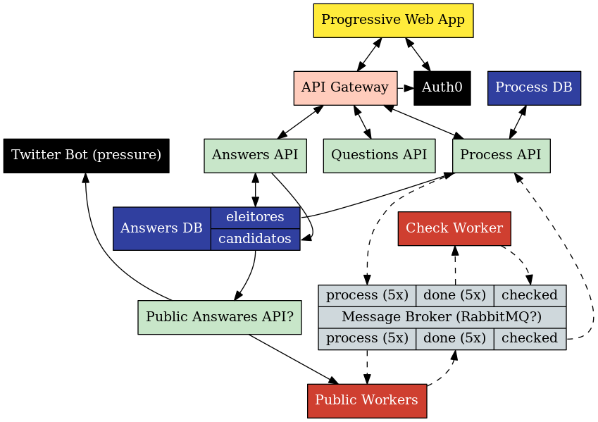

# VotaSP - Back-end

Esse repositório contém o código e a documentação do back-end do VotaSP. O repositório principal do VotaSP é [esse aqui](https://github.com/minhacps/votasp)

## Ambiente de desenvolvimento

### Prerequisitos

#### Docker

Para iniciar o ambiente de desenvolvimento, você vai precisar do `Docker` e do `Docker Compose`. Consulte as seguintes páginas para saber como instalar:

* [Instalação do Docker](https://docs.docker.com/install/)
* [Instalação do Docker Compose](https://docs.docker.com/compose/install/)

#### Configuração de hosts

Para configurar seu ambiente local de desenvolvimento, recomendamos [adicionar ao seu arquivo de hosts](https://www.tecmundo.com.br/sistema-operacional/5214-como-editar-os-arquivos-hosts-do-computador-.htm) o seguinte mapeamento:
```
127.0.0.1 questions.votasp.local answers.votasp.local public-answers.votasp.local process.votasp.local
```
Com esse mapeamento as urls listadas acima estarão configuradas para apontar para seu ambiente de desenvolvimento.

### Iniciando o ambiente

Para instruções de como iniciar cada componente do backend, consulte os READMEs específicos de cada um deles:
* [api-answers](/api-answers/README.md)
* [api-public-answers](/api-public-answers/README.md)
* [api-questions](/api-questions/README.md)
* [api-process](/api-process/README.md)


## Arquitetura

Se pudéssemos resumir a arquitetura em uma única imagem, seria algo do tipo:




### Front-end (amarelo)
O código do front-end pode ser encontrado [aqui](https://github.com/Minhacps/votasp-app)

### API's (verde e rosa)
Cada uma de nossas API's tem responsabilidades definidas e por si só são bem simples.

A idéia de termos feito dessa maneira é possibilitar que qualquer outra comunidade possa ajudar na linguagem que domina.

Já o `API Gateway` é responsável por transformar múltiplas API's em uma única. Ele existe para simplificar o desenvolvimento do Front-end.

#### Answers API
Essa API é responsável por armazenar e ler as respostas dos usuários.

Ela também pode escrever (apenas) respostas dos candidatos. (podemos dividi-la se acharem melhor)

Você pode ler mais sobre ela [aqui](https://github.com/Minhacps/votasp-backend/tree/master/api-answers).

#### Questions API
Essa API é responsável por ler as questões. Como essas questões são fixas, podemos pensar em uma forma simples e rápida de entrega.

Você pode ler mais sobre ela [aqui](https://github.com/Minhacps/votasp-backend/tree/master/api-questions).

#### Process API
Essa API é responsável por processar a informação e fazer o match para o usuário.

Ela é a mais complexa e você pode ler mais sobre ela [aqui](https://github.com/Minhacps/votasp-backend/tree/master/api-process)

#### Public Answers API
Essa API é responsável por ler as respostas dos candidatos e disponibiliza-las de forma pública.
A idéia por trás dessa API é possibilitar que projetos externos se conectem a ela. Assim poderemos usar esses dados de forma mais eficiente, já que as respostas dos candidatos são públicas.

Você pode ler mais sobre ela [aqui](https://github.com/Minhacps/votasp-backend/tree/master/api-public-answers).


### Workers (nossos guerreirinhos!) (Vermelhos)
Esses caras vão fazer o trabalho pesado do nosso projeto. Eles é quem vão fazer o match pra gente.

#### Public Worker
Esse worker fará o processo de match que está sendo definido na nossa [Prova de Conceito](https://github.com/Minhacps/votasp-poc-matcher).

Nossa idéia para esse worker é que ele fosse público para que qualquer pessoa instalar em sua máquina e ajudar a processar essas informações. A idéia inicial é ele ser público, mas se tivermos alguma dificuldade, usaremos ele internamente.

Por ele ser público vai nos ajudar a diminuir os custos com os servidores. Assim ficará mais fácil chegarmos a uma escala estadual ou até mesmo nacional se for preciso.

Você pode ler mais sobre ele [aqui](https://github.com/Minhacps/votasp-backend/tree/master/worker-public).

#### Checker Worker
Esse worker fará o processo de validação dos public workers. Como enviamos a mesma verificação para vários workers, ele é o responsável por agrupar essa informação e checar se houve alguma fraude.

Você pode ler mais sobre ele [aqui](https://github.com/Minhacps/votasp-backend/tree/master/worker-checker)


### Message Broker (Cinza)
Esse serviço é responsável por entregar as mensagens e organizar a fila de entrega das mesmas.
Já existem projetos prontos como o RabbitMQ que até onde estamos vendo atendem nossas necessidades.

Você pode ler mais sobre ele [aqui](https://github.com/Minhacps/votasp-backend/tree/master/message-broker).

### Bancos de dados (Azul)
São eles responsáveis por armazenar os dados da nossa aplicação. Estamos abertos a como eles serão montados, mas devem ser simples para os times que implementarão as API's que consomem deles.

#### Answers DB
Armazenam informações das respostas dos usuários.

Você pode ler mais sobre ele [aqui](https://github.com/Minhacps/votasp-backend/tree/master/api-answers/DB.md).

#### Process DB
Armazena as informações de processamento. Ele é um cache para não precisarmos ficar refazendo os cálculos o tempo todo.

Você pode ler mais sobre ele [aqui](https://github.com/Minhacps/votasp-backend/tree/master/api-process/DB.md).


### Serviços externos
Usaremos o Auth0 e teremos um bot no twitter.

#### Auth0
Nossos únicos dados de usuários ficam armazenados lá. A idéia é ter apenas dados relacionados a autenticação do usuário, quanto menos informação coletarmos, mais anonimato daremos aos usuários.

Com isso, todos os outros serviços só precisam ter acesso ao id do usuário e se ele é um candidado ou não.

#### Twitter Bot
Esse serviço é responsável por pressionar os candidados a responder as questões. (Gostei bastante do conceito que a Rosie do Serenata está fazendo)

Você pode ler mais sobre ele [aqui](https://github.com/Minhacps/votasp-backend/tree/master/bot-twitter).

## Infraestrutura
Você pode ler sobre como está nossa infra [aqui](https://github.com/Minhacps/votasp-backend/tree/master/infrastructure).

## Contribuição

Agradecemos por considerar contribuir com o VotaSP! Você encontra como fazê-lo em nosso [Guia de Contribuição](CONTRIBUTING.md).

## Código de Conduta

Para garantir que a comunidade do VotaSP seja acolhedora para todos, leia e siga o nosso [Código de Conduta](CODE_OF_CONDUCT.md).
